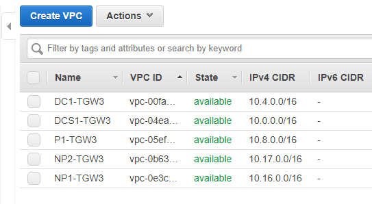
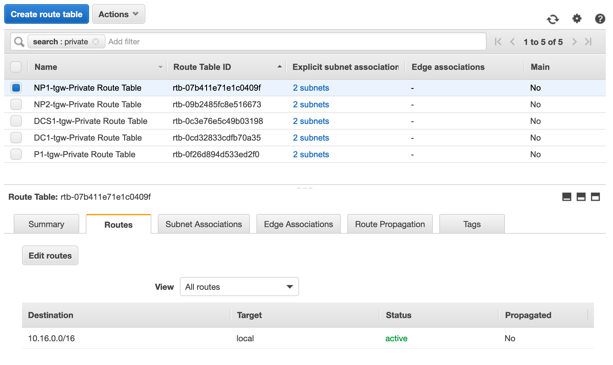
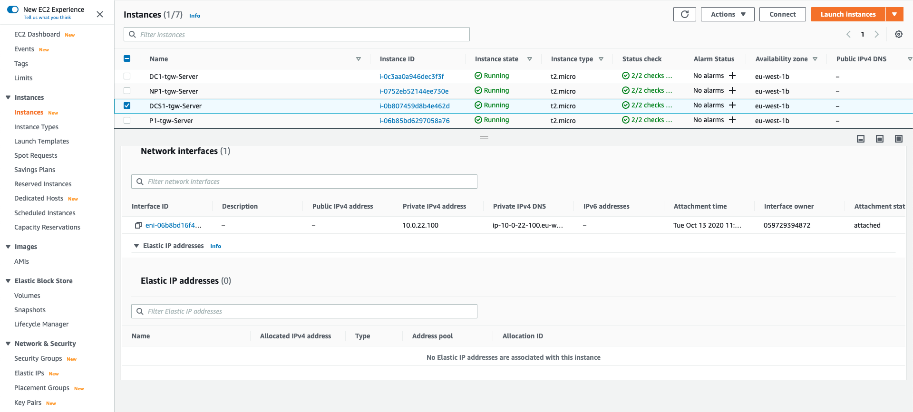
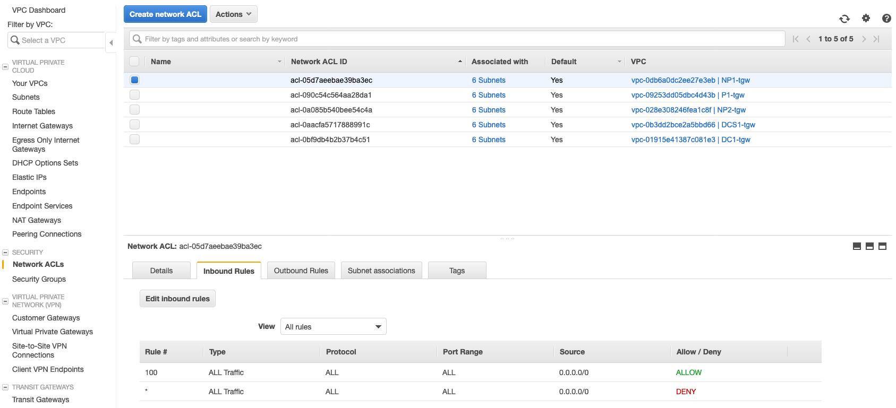
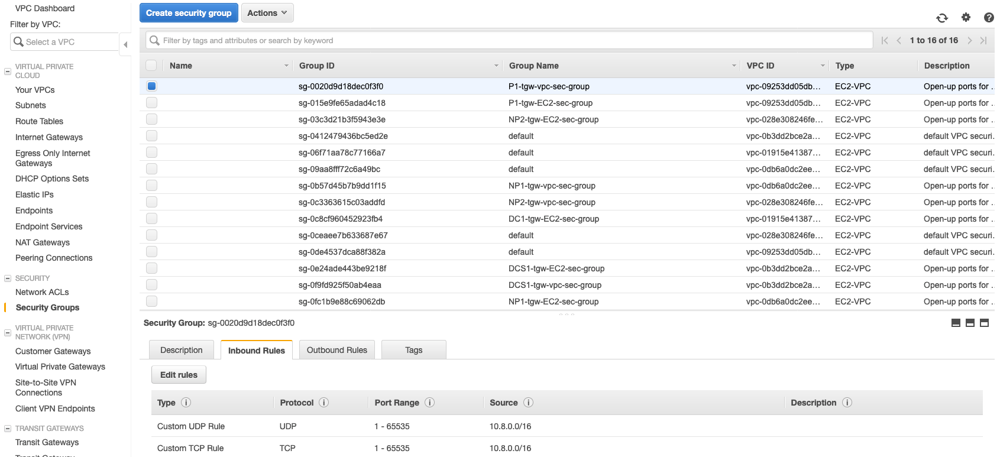
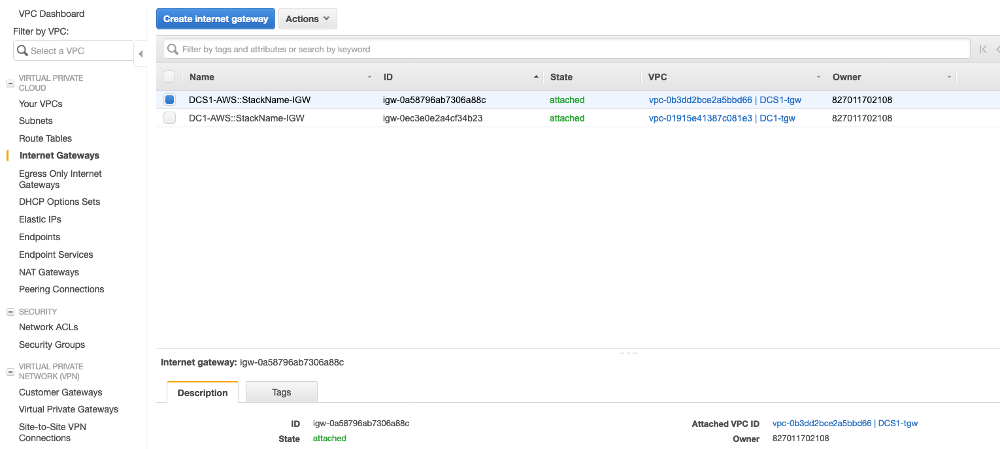
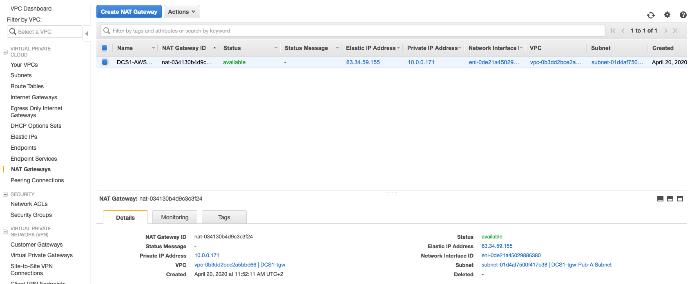

# VPC Components

Let's take some time to investigate each VPC component that we have deployed and perform some testing


## VPCs

1. In the AWS Management Console switch to the region you plan to work in. This is in the upper right hand drop down menu.

2. In the AWS Management Console choose **Services** then select **VPC**.

3. From the left-hand menu select **Your VPCs**.

4. Notice we have Created the following VPCs

   - P1-_your_stack_name_ (This is our Production VPC)
   - NP1-_your_stack_name_ (This is our Non-Production VPC number 1, a.k.a Development VPC)
   - NP2-_your_stack_name_ (This is our Non-Production VPC number 2, a.k.a Test VPC)
   - DCS1-_your_stack_name_ (This is our Shared Services VPC)
   - DS1-_your_stack_name_ (This is our Datacenter On-premise VPC)

   


</br>
</br>

## Subnets and Route Tables

We have partitioned each VPC into multiple subnets. For example, the Production VPC is partitioned into 6 subnets (3 subnets per Availability Zone). Each subnet has its own portion of the VPC CIDR range.

  

</br>Subnets are associated with Route Tables, which govern how traffic routes within the subnet. You will notice for example that both NP1-_your_stack_name_-Priv-A Subnet and NP1-_your_stack_name_-Priv-B Subnet share the same **route table**: NP1-_your_stack_name_-Private Route Table. And this route table has only a route for the local VPC CIDR block. This means that any instance present in this subnet will only have routing in that range. We will be changing that in the next lab, so that you can route outside of the NP1 VPC.

   

As a last comment in this section, the "Attachment" subnets are intended to serve as the Transit Gateway attachment subnets. This is a Transit Gateway best practice as it gives you total control about how you route traffic coming from the Transit Gateway within the VPC.


 <details> 
 <summary><p style="color:blue"><b>Lab #1 - QUESTION 1 </b><i>(Click to see the answer)</i></p>
  <b>Imagine that you spin up an EC2 instance within the subnet NP2-_your_stack_name_-Pub-A. If the instance tries to communicate with a destination in the Internet, what would happen?</b></br>
  a) The traffic would flow through the Internet Gateway as this is a Public Subnet </br>
  b) The traffic would be blackholed
  </summary><p>
  The correct answer is b)<p>
  - Once you locate the subnet in the AWS console, take a look at which Route Table is associated </br>
  - The Route Table associated to this subnet only routes to the VPC local CIDR. There is no route towards an Internet Gateway for Internet destinations. The traffic would be blackholed. </br>
   
 </details>
</br>
</br>
</br>

 <details>
 <summary><p style="color:blue"><b>Lab #1 - QUESTION 2 </b><i>(Click to see the answer)</i></p>
  <b>What if the EC2 instance has been spun up within the DCS1-_your_stack_name_-Pub-B subnet instead? Are we expecting the traffic to be blackholed?</b></br>
  </summary><p>
  Not in this case. This subnet is attached to a different Route Table. This Route Table has a default route pointing towards the Internet Gateway, which constitutes the VPC exit. We will touch base on the Internet Gateway later on:<p>
   
 </details>


</br>
</br>

## Elastic Network Interfaces (ENIs)

ENIs are widely used across many AWS resources, including EC2 instances. An ENI is a way to position a resource within a VPC, meaning reserving an ip for that resource to communicate within the VPC.  As part of this deployment, CloudFormation has created several EC2 instances for us. Each of these EC2 instances will have one or more ENIs (depending on the size of the instance) within the subnet (VPC) they landed on.</br>
Navigate to the EC2 section of the console (browsing through Services -> EC2 at the top left) and locate the DC1 server. You can see how the server interface "eth0" is mapped to an ENI:

   


</br>
</br>

## NACLs and Security Groups

NACLs restrict traffic coming in/out of your subnets and constitute the first layer of defense you can define within the VPC:
- NACLs are associated with subnets
- NACLs are stateless. This means that you would need to define both "inbound" and "outbound" rules in order to allow traffic entering or leaving your subnets
- NACLs are made of different statements, evaluated from top to bottom. Whenever there is a match, the evaluation is over
- There is an implicit Deny at the end

   

</br>

Security Groups act as a virtual firewall for your instances to control inbound and outbound traffic. They provide additional granularity while compared to NACLs:
- Security Groups are associated with your EC2 instance ENIs
- Security Groups are stateful
- Security Groups are based on rules and only "allow" communications. As such, you can't deny an specific communication with a security group rule. 
- Related to the previous item: as you can only "allow" communications, anything else is denied by default
- There is no order defined for rule evaluation (opposite to the NACL statements, in which they go 1 by 1)

   


</br>
</br>

## Internet Gateway
An Internet gateway is a horizontally scaled, redundant, and highly available VPC component that allows communication between instances in your VPC and the Internet. It therefore imposes no availability risks or bandwidth constraints on your network traffic.
Only 1 Internet gateway can be attached to a VPC at a given time. This virtual device is referenceable by the VPC routing tables. It acts as the edge device of your VPC.

  

Internet Gateways are used along with "public subnets" to route traffic outside of your VPC. A "public subnet" is just a regular subnet attached to a Routing table in which there is a route towards an Internet Gateway.

 <details>
 <summary><p style="color:blue"><b>Lab #1 - QUESTION 3 </b><i>(Click to see the answer)</i></p>
  <b>Locate the instance launched within the DCS1 VPC. Is this instance located in a Public Subnet and hence will be able to send traffic to the Internet?</b></br>
  a) No, the instance is located in a Private Subnet as there is no entry pointing towards an Internet Gateway in the routing table. However, there is a default route 0.0.0.0 pointing to a NAT Gateway so it will be able to send traffic out to the internet</br>
  b) Yes, the instance is located in a Public Subnet as there is a default route 0.0.0.0 in the routing table </br>
  </summary><p>
  The correct answer is a)<p>
  Navigate to the EC2 instance and look for its subnet:<p>
  
  Once in the subnet, find out the route table association. There is a default route pointing towards a NAT Gateway and there is no Internet Gateway presence. Let's learn more about NAT Gateways in the following section:<p>
  
 </details>


  
</br>
</br>

## NAT Gateway
NAT Gateways are AWS managed devices that enable instances in a <b>private subnet</b> to connect to the Internet or other AWS services, but prevent the Internet from initiating a connection with those instances. NAT Gateways are associated with public subnets, meaning that they also rely on Internet Gateways for their own Internet connectivity. However, instances in private subnets rely on them to route traffic to the Internet.</br>
This is the only NAT Gateway we have configured so far and it's actually the same device we have seen on the previous section. Notice that is currently associated with a <b>public subnet</b>:

  


</br>
</br>

## Elastic IPs/Public IPs

Both are public ips in a sense. However, Elastic ips are "reserved" to your account and you can potentially re-use them across different resources (such as different ENIs asigned to EC2 instances). Public ips are only bound to a single resource. If the resource is deleted, the public ip is released to AWS. A typical example of a public ip is allocating a public ip to an EC2 instance that will live in a public subnet.
Instances placed within private subnets don't really need any public/elastic ip assigned. They rely on NAT Gateways for Internet communication.

 <details>
 <summary><p style="color:blue"><b>Lab #1 - QUESTION 4 </b><i>(Click to see the answer)</i></p>
  <b>As part of the CloudFormation deployment, at least one EC2 instance per VPC has been spun up. Let's take a look at all the Elastic and Public ips allocated to our EC2 instances. The easiest way to check that is just placing yourself at the "Network Interfaces" section and scrolling to the right:
  
  How many instances hold an elastic/public ip (not taking into account the Cloud9 EC2 instance)?</b>
  </summary><p>
  The answer is none. The only elastic/public ip allocated belongs to a NAT Gateway. And how is that feasible? It turns out that all the instances are located in private subnets so they don't need any public/elastic ip addressing.
 </details>


</br>
</br>


## Connect to the shell of a Linux EC2 instance

1. In the AWS Management Console choose **Services** then select **Systems Manager**. Systems Manager Gains Operational Insights and Takes Action on AWS Resources. We are going to take a look at just one of its many capabilities.

2. From the menu on the left, Scroll down and select **Session Manager**. Session Manager allows to using IAM roles and policies to determine who has console access without having to manage SSH keys for our instances.

3. In the main pane, click the **Start session** button. Select the radio button next to the instance you wish to log into. You will now receive a Bash shell prompt for that instance.

4. Run a few commands like **ifconfig** or **cat /etc/resolv.conf**

   ```
   sh-4.2$ ifconfig
   eth0: flags=4163<UP,BROADCAST,RUNNING,MULTICAST>  mtu 9001
           inet 10.16.21.58  netmask 255.255.248.0  broadcast 10.16.23.255
           inet6 fe80::13:45ff:fe79:926c  prefixlen 64  scopeid 0x20<link>
           ether 02:13:45:79:92:6c  txqueuelen 1000  (Ethernet)
           RX packets 963  bytes 177300 (173.1 KiB)
           RX errors 0  dropped 0  overruns 0  frame 0
           TX packets 1474  bytes 317453 (310.0 KiB)
           TX errors 0  dropped 0 overruns 0  carrier 0  collisions 0

   lo: flags=73<UP,LOOPBACK,RUNNING>  mtu 65536
           inet 127.0.0.1  netmask 255.0.0.0
           inet6 ::1  prefixlen 128  scopeid 0x10<host>
           loop  txqueuelen 1000  (Local Loopback)
           RX packets 8  bytes 648 (648.0 B)
           RX errors 0  dropped 0  overruns 0  frame 0
           TX packets 8  bytes 648 (648.0 B)
           TX errors 0  dropped 0 overruns 0  carrier 0  collisions 0

   sh-4.2$ cat /etc/resolv.conf
   ; generated by /usr/sbin/dhclient-script
   search us-west-2.compute.internal
   options timeout:2 attempts:5
   nameserver 10.16.0.2
   ```

 <details>
 <summary><p style="color:blue"><b>Lab #1 - QUESTION 5 </b><i>(Click to see the answer)</i></p>
  <b>Without further changes, there is only 1 instance capable of communicating with the Internet. Before you unveil the answer below, try to log into the instance using Session Manager and issue a ping towards an Internet destination (i.e. ping 8.8.8.8). Note that security groups/NACLs in place will allow this traffic. Which instance are we talking about?</b>
  </summary><p>
  The instance placed within the DCS1 VPC is the correct answer. How did we get here? </br>
  - From the previous sections, we know that all the instances are located in private subnets </br>
  - As there is only one NAT Gateway configured, this NAT Gateway must belong to the same instance VPC </br>
  - Once in that VPC, the routing table used by the VPC instances must contain a route to the Internet via the NAT Gateway </br>
 </details>


</br>
</br>

## Congratulations

You now have **completed** this section. Continue to the next section to setup communication between the VPCs and your Datacenter.
