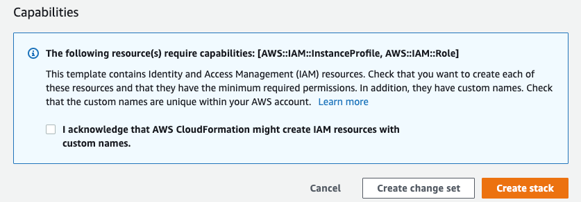

# Datacenter Router and Transit Gateway Deployment

Using a predefined CloudFormation template we will deploy a Cisco Router (Cisco CSR) into the Datacenter VPC simulating our on-premise VPN router.
In addition, a Transit Gateway will be deployed with a couple of Transit Gateway route tables.

1. Click on the CloudFormation Launch link below that corresponds to the AWS Region in which you deployed the first stack:

   
   
   
   
   
   

2. For the **Specify stack details** give the stack a name (compounded names work well. i.e. if the VPC stack created in the first lab was named **TGW1**, name this stack **TGW1-CSR**), pick the keypair you created earlier and enter the name of your first stack (must be entered exactly to work). Also stick with "Cisco" as the router vendor. Click **Next**.
   

3. For **Configuration stack options** we don't need to change anything, so just click **Next** in the bottom right.

4. Scroll down to the bottom of the **Review name_of_your_stack** and check the **I acknowledge the AWS CloudFormation might create IAM resources with custom names.** Click the **Create** button in the lower right.
   

5. Wait for the Stack to show **Create_Complete**.
   