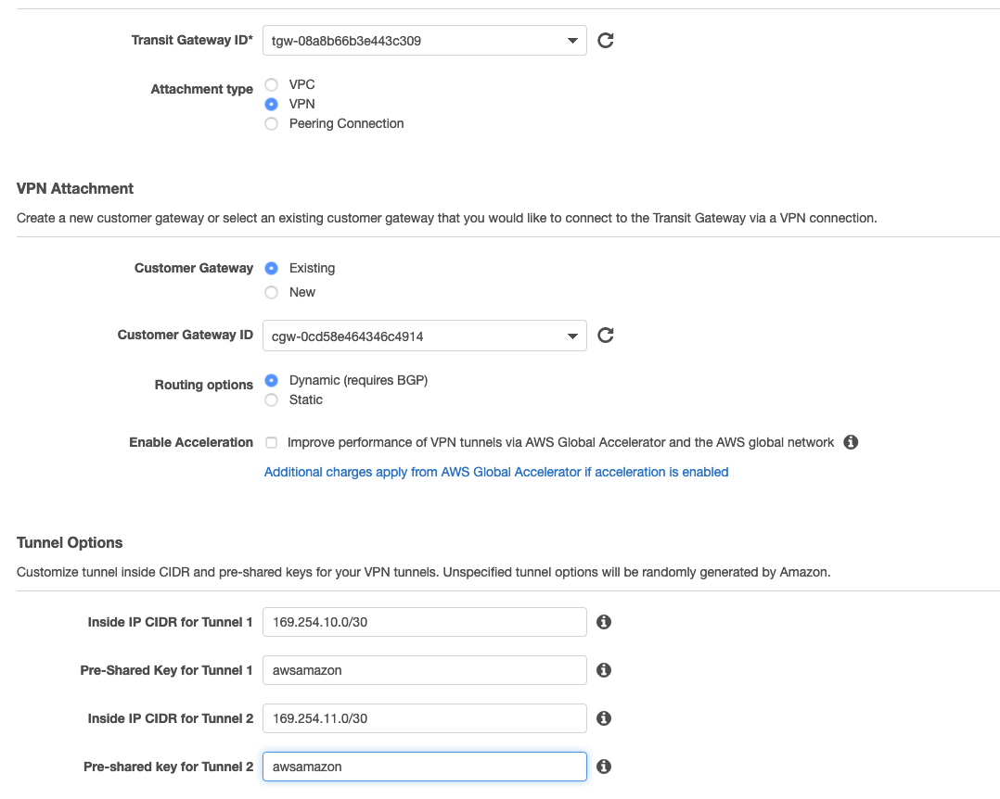
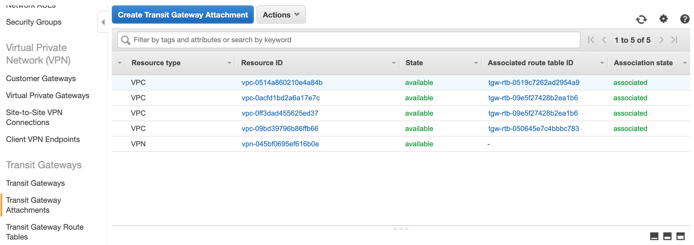
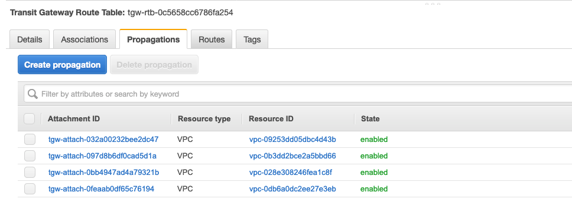
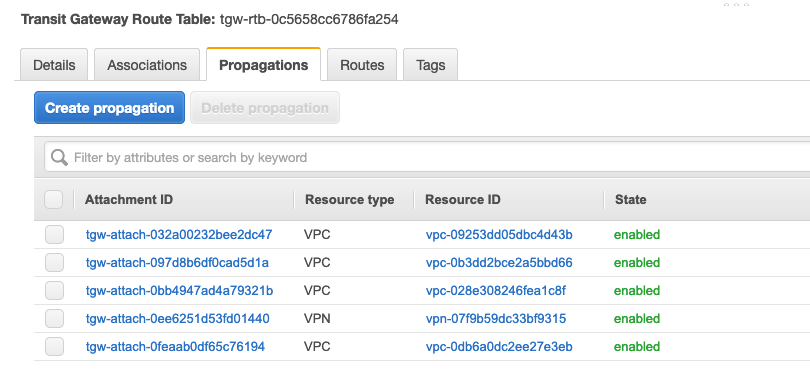

# Site-to-site VPN between the Datacenter VPC and the Transit Gateway

What are we going to do? We will create two VPN tunnels from the Transit Gateway and connect them into a single instance of the Cisco CSR in the Datacenter VPC. This would simulate site-to-site VPNs between the AWS environment and your on-premise/HQ network. We are emulating a common VPN between AWS and the typical Cisco/Juniper or any other router/firewall in your On-premise/HQ network:

<p align="center">
  
</p>


In a real production environment we would setup a secondary router for redundancy and for additional bandwidth. Each VPN ipsec tunnel provides up to 1.25Gbps. While using multiple ipsec tunnels we can provide additional bandwidth with the use of ECMP (Equal cost multipath), meaning that all the tunnels will be used. On the AWS side, up to 50 parallel (ECMP) paths are supported. Many vendors support 4-8 ECMP paths, so check with your vendor in advance:

1. In the AWS Management Console change to the region you are working in. This is in the upper right hand drop down menu.

1. In the AWS Management Console choose **Services** then select **VPC**.

1. From the menu on the left, scroll down and select **Transit Gateway Attachments**.

1. You will see the VPC Attachments listed, but we want to add one to connect our Datacenter VPC. Click the **Create Transit Gateway Attachment** button above the list.

1. Fill out the **Create Transit Gateway Attachment** form. Exactly as below: (_Note: these choices will match our config of the router on the other side of the VPN tunnels_)

  - **Transit Gateway ID** refers to the Transit Gateway device already provisioned by the Cloudformation template
  - **Attachment Type** is **VPN**
  - **Customer Gateway** (CGW) will be **Existing**. _Note: the CloudFormation template created the CGW. This is the IP address of our Datacenter VPN device and it matches the Elastic IP of the EC2 instance running the Cisco CSR._
  - Leave **Routing options** set to **Dynamic(requires BGP)**. _Note: BGP is required if you want traffic to balance across more than one VPN tunnel at a time (ECMP or Equal Cost Multipathing)_
   - Do not tick Enable Acceleration as we won't be using it for this lab. However, for production environments GA delivers an enhanced VPN experience thanks to the use of anycast endpoints being advertised from our global network of points of presence (POPs) 
  - For **Inside IP CIDR for Tunnel 1** use **169.254.10.0/30** for CIDR.
  - For **Pre-Shared Key for Tunnel 1** use **awsamazon**
  - For **Inside IP CIDR for Tunnel 2** use **169.254.11.0/30**for CIDR.
  - For **Pre-Shared Key for Tunnel 2** use **awsamazon**
  - Once the page is filled out, click **Create attachment** at the bottom right.
  

1.  While we are on the **Transit Gateway Attachments** page, lets go back to the top and give the VPN attachment a name. Scan down the **Resource type** column for the VPN Attachment. _Note: you may have to hit the refresh icon in the upper right above the table to get the new VPN to show. If you click the pencil that appears when you mouse over the **Name** column, you can enter a name. Be sure to tick the check mark to save the name._

1.  From the Menu on the left select **Site-to-Site VPN Connections**. From the main panel, you likely will see the VPN is in State **Pending**. That's fine. Let's take a look towards the bottom, and click the **Tunnel Details** tab. Note down the two **Outside IP Addresses**. We want to record them in the order of the one pairing up with the **Inside IP CIDR** range 169.254.**10**.0/30 first. _Note: You can use Cloud9 as a scratch pad, by clicking the + in the main panel and selecting **New file**. be sure to paste them in the right order!_

1.  From the menu on the left, scroll down and select **Transit Gateway Attachments**. We need to verify that the attachment we created above is no longer in status **pending**. Instead it should be in state **available** (it might take 4-7 mins) like all of the VPC attachments in the list.

    

1.  From the Menu on the left select **Transit Gateway Route Tables**. From the table in the main panel select **Green Route Table**. Let’s take a look towards the bottom, and click the **Associations** tab. Associations mean that traffic coming from the outside towards the Transit gateway will use this route table. A routing lookup will take place in the TGW at this stage and the packet will be forwarded based on the information available within the “Routes” tab. _Note: An attachment can only be Associated with one route table but a route table can have multiple associations._
 Here in the **Green Route Table** there is an association already present: the **Datacenter Services VPC**. We need to create a new association for the VPN attachment previously created. Click **Create associations** in the **Associations** tab. From the drop-down list, select the VPN connection. Click **Create association**. Below is an snapshot displaying the VPN connection being associated:
    

1.  While at the **Transit Gateway Route Tables**, take a look at the **Propagations** tab. These are the attachments that propagate its prefixes into the route table (take it as an import into the route table). An attachment can propagate to multiple route tables. For this lab we want the datacenter addressing (the one reachable via the VPN connections) propagated to all of the route tables so the VPCs associated with each route table can route back to the datacenter. Let’s start with the **Green Route Table**. We can see all of the VPCs are propagating their CIDR to the route table: 
    

    Click on **Create Propagation** and propagate from the only VPN attachment available (for now):
    

1.  Repeat the above step on the propagations tab for the **Red Route Table** and the **Blue Route Table**.

1.  Take a look at each of the route tables and notice the tab **Routes**. You can see the routes that are propagated, as well as a static route table that was created for you by the CloudFormation template. That's the default route (0.0.0.0/0) that will direct traffic destined for the Internet to the **Datacenter Services VPC** and ultimately through the NAT Gateway in that VPC. _Note: there is also a route table with no name. This is the default route table. In this lab we do not intend to use it_.

1.  Now it's time to get the other end ready and apply the configuration to the Cisco router so we can bring the VPN tunnels up. We will carry out this action generating the Cisco configuration file. In order to do that, go back to the Cloud9 browser tab. Using the two VPN public tunnel endpoints ips generated from the step above, cd to tgwwalk on the Cloud9 bash console and run the bash script appending the 2 ips and the name of the configuration file:
  ```
 ./createcsr.sh publicip1 publicip2 mycsrconfig.txt
 ```
_Note: Make sure you put the ip address that lines up with Inside IP CIDR address 169.254.10.0/30 for ip1. This will result in a Cisco configuration file ready to be used_

    Example from my Site-to-Site VPN, note your public ips will be different:
    

    ```
    cd tgwwalk
    ##./createcsr.sh ip1 ip2 outputfile
    ./createcsr.sh 35.166.118.167 52.36.14.223 mycsrconfig.txt
    ```

    _Note: AWS generates starter templates to assist with the configuration for you on-premise router. For your real world deployments, you can get a starter template from the console for various device vendors (Cisco, Juniper, Palo Alto, F5, Checkpoint, etc). You can get those configurations via the "Download configuration" button within the Site-to-Site VPN Connections section explored before

1.  On the left hand panel, the output file **mycsrconfig.txt** should be listed. You may have to open the tgwwalk folder to see the txt file. Open the file with **cat** or any alternative and copy all the file content

1.  Using a bash tab in cloud9, ssh back into the CSR. _Note: the **ssh** command for the CSR is available from the **Exports** menu in **CloudFormation**._

1.  Enter configuration mode by entering **conf t**, which will take you to a config prompt:

    ```
    ip-10-4-0-17#conf t
    Enter configuration commands, one per line.  End with CNTL/Z.
    ip-10-4-0-17(config)#
    ```

1.  Once in Configuration mode _Note: you should see (config)# prompt_, paste all text (ctrl-v on pc/command-v on mac) from the output file created in step 14. This will slowly paste the configuration.

1.  Once the paste is finished, if you are still at the (config)# or (config-router)# prompt, type **end** and press enter.

1.  Now lets look at the new interfaces with the command: **sh ip int br**. You should see new interfaces: Tunnel1 and Tunnel2. They should be up. _Note: if they do not change from down to up after a minute, likely cause is the ip addresses were flipped in the createcsr script._
    
    

1.  Lets make sure we are seeing the routes on the Cisco CSR. first we can look at what BGP is seeing: **show ip bgp summary**. The most important thing to see is the State/PfxRcd (Prefixes received). If this is in Active or Idle (likely a neighbor statement is wrong: IP address, AS number) there is a configuration issue. What we want to see is a number. In fact if everything is setup correctly we should see 4 for each neighbor:

    ```
    ip-10-4-0-17#sh ip bgp summ
    BGP router identifier 169.254.10.2, local AS number 65001
    BGP table version is 6, main routing table version 6
    5 network entries using 1240 bytes of memory
    9 path entries using 1224 bytes of memory
    2/2 BGP path/bestpath attribute entries using 560 bytes of memory
    1 BGP AS-PATH entries using 24 bytes of memory
    0 BGP route-map cache entries using 0 bytes of memory
    0 BGP filter-list cache entries using 0 bytes of memory
    BGP using 3048 total bytes of memory
    BGP activity 5/0 prefixes, 9/0 paths, scan interval 60 secs

    Neighbor        V           AS MsgRcvd MsgSent   TblVer  InQ OutQ Up/Down  State/PfxRcd
    169.254.10.1    4        65000      40      43        6    0    0 00:06:03        4
    169.254.11.1    4        65000      40      44        6    0    0 00:06:04        4
    ip-10-4-0-17#
    ```

1.  We can also see what those routes are and how many paths we have with the **show ip route bgp** command. Note that there is 1 BGP route per VPC (NP1, NP2, P1 and DCS1)

    ```
    ...<output omitted>
              10.0.0.0/8 is variably subnetted, 7 subnets, 3 masks
    B        10.0.0.0/16 [20/100] via 169.254.10.1, 09:52:48
    B        10.8.0.0/16 [20/100] via 169.254.10.1, 09:52:48
    B        10.16.0.0/16 [20/100] via 169.254.10.1, 09:52:48
    B        10.17.0.0/16 [20/100] via 169.254.10.1, 09:52:48
    ```

1.  Notice that there is only one next-hop address for each of the VPCs CIDRs, despite having 2 tunnels in place. This is the result of not using ECMP by default. We can fix this by allowing ECMP in the Cisco CSR router.
    Back in config mode we will set maximum-paths to 8 in our BGP router. Just drop these commands:

    ```ip-10-4-0-17# config t
      router bgp 65001
      address-family ipv4
      maximum-paths 8
      end
    ```

    Now, run **sh ip route bgp** command again. See, we are learning BGP routes over both tunnels!

          ```
          ...<output omitted>
          Gateway of last resort is 10.4.0.1 to network 0.0.0.0

                10.0.0.0/8 is variably subnetted, 7 subnets, 3 masks
          B        10.0.0.0/16 [20/100] via 169.254.11.1, 00:00:04
                               [20/100] via 169.254.10.1, 00:00:04
          B        10.8.0.0/16 [20/100] via 169.254.11.1, 00:00:04
                               [20/100] via 169.254.10.1, 00:00:04
          B        10.16.0.0/16 [20/100] via 169.254.11.1, 00:00:04
                                [20/100] via 169.254.10.1, 00:00:04
          B        10.17.0.0/16 [20/100] via 169.254.11.1, 00:00:04
                                [20/100] via 169.254.10.1, 00:00:04
          ip-10-4-0-17#
          ```

1.  Just to verify where those routes are coming from, we can take a look at the **Green Route Table**. _Note: remember, it's under the **VPC** service and **Transit Gateway Route Tables** at the bottom of the left menu._ There should be **5** routes listed. 

 <details>
 <summary><p style="color:blue"><b>Lab #2 - QUESTION 1 </b><i>(Click to see the answer)</i></p>
  <b>If we have 5 routes in this Transit Gateway route table, why do we have just 4 routes being received at the Cisco CSR?</b></br>
  </summary><p>
  As you might have guessed, the route 10.4.0.0/16 is the VPC CIDR for the DataCenter VPC in which the Cisco CSR lives. The Cisco CSR is advertising this route to the Transit Gateway. You can actually check that checking the router configuration with <b>sh run</b> and scrolling down to the BGP section: </br>
   <xmp>
    router bgp 65001
     bgp log-neighbor-changes
     neighbor 169.254.10.1 remote-as 65000
     neighbor 169.254.10.1 timers 10 30 30
     neighbor 169.254.11.1 remote-as 65000
     neighbor 169.254.11.1 timers 10 30 30
     !
     address-family ipv4
      network 10.4.0.0 mask 255.255.0.0
      neighbor 169.254.10.1 activate
      neighbor 169.254.10.1 soft-reconfiguration inbound
      neighbor 169.254.11.1 activate
      neighbor 169.254.11.1 soft-reconfiguration inbound
      maximum-paths 8
     exit-address-family
    </xmp>
 </details>
