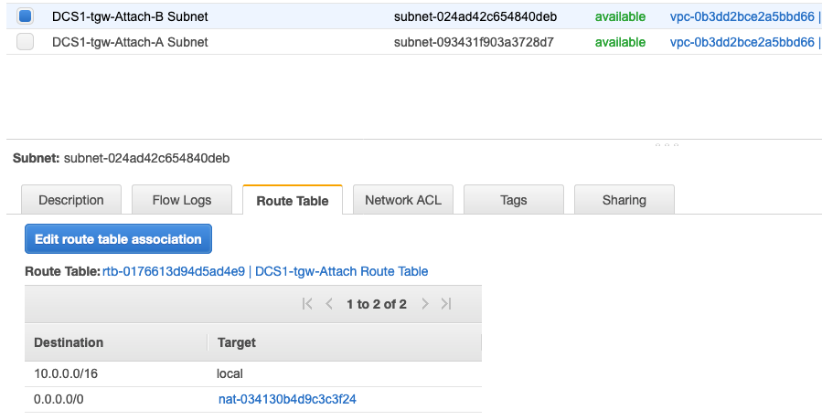
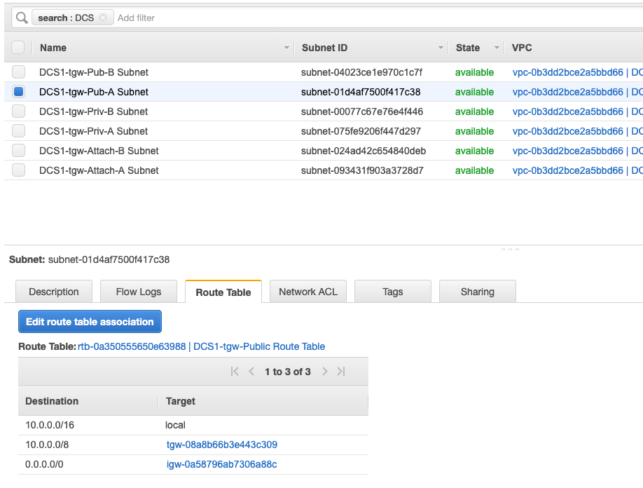

#Transit Gateway Routing

This is the final picture. We are not there yet but please use this diagram as a reference:


## Adding routes in the VPC Route Tables

While the CloudFormation Template created attachments to the VPCs and route tables within the Transit Gateway. We need to setup routing within the VPC. What traffic do we want going from each subnet to the Transit Gateway?	

1. In the AWS Management Console change to the region you are working in. This is in the upper right hand drop down menu.

1. In the AWS Management Console choose **Services** then select **VPC**.

1. From the menu on the left, scroll down and select **Route Tables**.

1. You will see the Route Tables listed in the main pane. Lets Start with **NP1-_stackname-Private** route table. Let take a look towards the bottom of the panel and click the Routes tab. Currently, there is just one route, the local VPC route. Since the only way out is going to be the Transit Gateway, lets make our life simple and point a default route to the Transit Gateway. Click the **Edit Routes** in the Routes tab.

1. On the Edit routes page, click the **Add route** button and enter a default route by setting the destination to 0.0.0.0/0. In the Target drop-down, select **Transit Gateway** and pick your Transit Gateway created for this project. It should be the only one. 
   

1. Repeat the above step for the following route tables:
   - NP2-_stack_name_-Private
   - P1-_stack_name_-Private

1. For the **DCS1-_stackname-Public** and **DCS1-_stackname-Private** where our NAT Gateway is, we need a special route. We already have a default route pointed to the Internet Gateway(IGW) for the public and to the NAT Gateway(NGW) for the private to get to the Internet, so we need another entry to route internally. Let’s use the RFC1918 10.0.0.0/8 CIDR as that can only be internal and allows for future expansion without changes. The other VPC ranges 10.X.0.0/16 won’t match the Local Route already present in the Route Table (10.0.0.0/16 -> Local). So just add **10.0.0.0/8** pointing to the Transit Gateway. Follow the same steps as before for both Route tables (Private/Public). Be sure not to alter the 0.0.0.0/0 route.

1. Because the CloudFormation template already created a Security Group to allow ICMP traffic from 10.0.0.0/8, we should now be able to test pings from lots of places.

1. Let's find out the instance private ips for testing. The Cloud9 instance already has the AWS CLI installed so it's pretty easy to get details from your AWS environments via API calls from the AWS CLI. Use this handy command from the Cloud9 instance:

	```
	 aws ec2 describe-instances | grep "PrivateIpAddress" | cut -d '"' -f 4 | awk 'NR == 0 || NR % 4 == 0'
	```

	Note that: </br>
	10.0.x.x is the DCS1 instance </br>
	10.4.x.x are the DC1 instances (the Cisco CRS router, the Cloud9 instance and a regular instance for testing) </br>
	10.8.x.x is the P1 instance </br>
	10.16.x.x is the NP1 instance </br>
	10.17.x.x is the NP2 instance </br>

1. Go back to the **Systems Manager** service within the EC2 console. Scroll down and select **Session Manager**. As noted before, Session Manager allows us to use IAM role and policies to determine who has console access without having to manage ssh keys for our instances.

1. In the main pane, click the **Start session** button. Pick the NP1 instance to shell into. You will now enter a bash shell prompt for that instance.

1. Let's ping the NP2 server. Every one second or so, you should see a new line showing the reply and roundtrip time.

```
ping 10.17.22.100
sh-4.2$ ping 10.16.22.100
PING 10.16.22.100 (10.16.22.100) 56(84) bytes of data.
64 bytes from 10.16.22.100: icmp_seq=1 ttl=254 time=1.09 ms
64 bytes from 10.16.22.100: icmp_seq=2 ttl=254 time=0.763 ms
64 bytes from 10.16.22.100: icmp_seq=3 ttl=254 time=0.807 ms
64 bytes from 10.16.22.100: icmp_seq=4 ttl=254 time=0.891 ms
64 bytes from 10.16.22.100: icmp_seq=5 ttl=254 time=0.736 ms
64 bytes from 10.16.22.100: icmp_seq=6 ttl=254 time=0.673 ms
64 bytes from 10.16.22.100: icmp_seq=7 ttl=254 time=0.806 ms
^C
+++ 10.16.22.100 ping statistics +++
7 packets transmitted, 7 received, 0% packet loss, time 6042ms
rtt min/avg/max/mdev = 0.673/0.824/1.096/0.130 ms
```

Troubleshooting: if you are unable to ping a server here are a few things to check:
- Go to the EC2 service and double-check the private IP address of the device you want to ping to
- Go to the VPC service and verify that you have the 0.0.0.0/0 route pointing to the TGW for VPCs NP1,NP2, and P1. Verify that you have the 10.0.0.0/8 route in the DCS VPC for both public and private subnets while you are there.
- Finally, verify that you went through the check for the TGW route tables propagation and the CSR is receiving routes (see the **Setup VPN Between Datacenter and Transit Gateway** section above)


## Discussing some Traffic Flows

Feel free to scroll up to see the diagram

**NP1 to NP2 (tested in the section above)**
- A packet leaving an EC2 instance within the NP1 VPC will route through the TGW according to the local VPC private route table. As the NP1 attachment is associated with the **Red Route Table**, the packet will land there. A new ip lookup will take place in this Red Route Table and the packet will be forwarded out to the NP2 attachment as a result.
- The packet will return following the same flow

</br>

**NP1 to DCS1**
- Ping the DCS1 EC2 instance and confirm connectivity
- A packet leaving an EC2 instance within the NP1 VPC will route through the TGW according to the local private route table in the VPC. As the NP1 attachment is associated with the **Red Route Table**, the packet will land there. A new ip lookup will take place in this Red Route Table and the packet will be forwarded out to the DCS attachment as a result.
<details>
 <summary><p style="color:blue"><b>Lab #2 - QUESTION 2 </b><i>(Click to see the answer)</i></p>
  <b>At the time of coming back, do you think the packet will land again in the Red Route Table (as it did with the NP1 to NP2 traffic flow)?</b></br>
  </summary><p>
  The answer is no.
  The return packet will leave the DCS instance and route through the TGW landing in the **Green Route Table**. A new ip lookup will take place and the packet will be forwarded to the NP1 VPC via the attachment. 
 </br>   
 </details>

</br>

**NP1 to P1**
- Ping the P1 EC2 instance and confirm connectivity
- Hold on, are we supposed to have connectivity between Non-Prod and Prod environments? That shouldn't be the case. 
<details>
 <summary><p style="color:blue"><b>Lab #2 - QUESTION 3 </b><i>(Click to see the answer)</i></p>
  <b>This is a tough question. With the current setup, how do you think the packet is being routed between the NP1 VPC and the P1 VPC? Try to follow the diagram and the different ip lookups being carried out</b></br>
  </summary><p>
	- A packet leaving an EC2 instance within the NP1 VPC will route through the TGW according to the local VPC private route table. As the NP1 attachment is associated with the <b>Red Route Table</b>, the packet will land there. A new ip lookup will take place in this Red Route Table and the packet will be forwarded following the default route to the DCS1 attachment as a result. </br> 
	- The packet lands in the DCS1 Attachment subnet, a new ip lookup takes place and the packet gets forwarded towards the NAT Gateway following the default route 0.0.0.0/0:

	

	- The NAT Gateway lives in the Public Subnet within the VPC so the packet lands there. A new ip lookup happens as this subnet is attached to a different route table. The routing entry pointing to 10.0.0.0/8 matches so the packet is routed back to the Transit Gateway:

	

	- Once in the Transit Gateway, the packet lands in the <b>Green Route Table</b>. This route table has a direct route to the P1 VPC so the packet gets forwarded to the P1 attachment as a result. </br> 
	- The return packet will follow the same magic, landing in 2 different tables in the Transit Gateway and crossing the DCS1 VPC.
 
 </details>

</br>
</br>


## Restricting communication between Prod and Non-Prod environments

Let's fix the problem by using BlackHole Routes. We will explain how to add them within the **Blue Route Table**, which corresponds to the return packet discussed during the Question 3 above:

1. In the AWS Management Console choose **Services** then select **VPC**.

1. From the menu on the left, scroll down and select **Transit Gateway Routes Tables**.

1. From the table in the main panel select **Blue Route Table**. Let's take a look towards the bottom, and click the **Routes** tab.

1. Take a look at the existing routes and see the 0.0.0.0/0 route that is sending data destined for the Non-prod address to the **Datacenter Services VPC**. Let's prevent that. Click the **Add route** button.

1. At the Create route screen, for the **CIDR** enter **10.16.0.0/13** and tick the box next to **Blackhole**. This will drop any traffic destined to the Production VPCs. 

   

1. Make sure to repeat the blackhole route in the **Red Route Table** by creating a blackhole route for 10.8.0.0/13.

1. Go back to Session Manager and connect to the P1 server. Re-attempt to ping the NP1 or NP2 servers. Pings should fail now.


