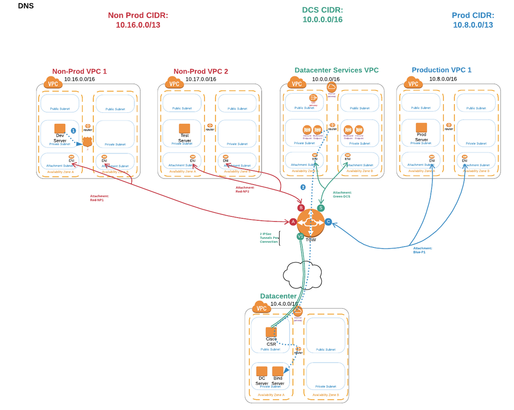

# Hybrid DNS Overview

Many customers need their AWS environment to communicate with their on-premise datacenter(s). At the time of architecting this connectivity DNS is one of the main players in the room as resources on-premise will need to resolve DNS names for resources in AWS and vice-versa.

In this lab we will show how to integrate on-premise DNS servers with AWS Route 53 so we can both coexist in armony. In the next section, we will deploy the following resources:
- Route 53 Internal Endpoints, as the DNS entry point to AWS
- Route 53 External Endpoints, as the DNS exit point from AWS
- 4 Route 53 Internal Zones, one for each domain we want to host in AWS
- A DNS Bind server within the DataCenter VPC (simulating a real DNS server on-premise)
- An additional Route 53 External Endpoint for the DataCenter VPC. This shouldn't be needed in a real environment. In this case it's actually needed because the on-premise datacenter is a VPC and we want to capture and forward DNS queries to the Bind Server

Let's illustrate how traffic would flow on both directions: 

<b>On-premise -> AWS flow diagram</b> 
XXXFor the sake of this lab, we have deployed a Route53 Outbound Endpoint Resolver attached to the Datacenter VPC with a rule that sends certain DNS traffic to the Bind Server present within the VPC itself. The Bind Server is then configured to send this DNS traffic to the Route53 Inbound Endpoint Resolver in the DCS VPC. This Inbound Endpoint has awareness of the Private Hosted Zones within the VPC and will be able to resolve several DNS names like “np1.example.com” or “p1.example.com”

<b>AWS -> On-premise flow diagram</b> 

On the other hand, if we try to resolve a DNS name not available in the Internal hosted zones for the VPC, the DNS query gets forwarded outside of the VPC according to the rules present in the Route53 Outbound Endpoint Resolver for the VPC. The rule point to the Bind Server as the resolver

