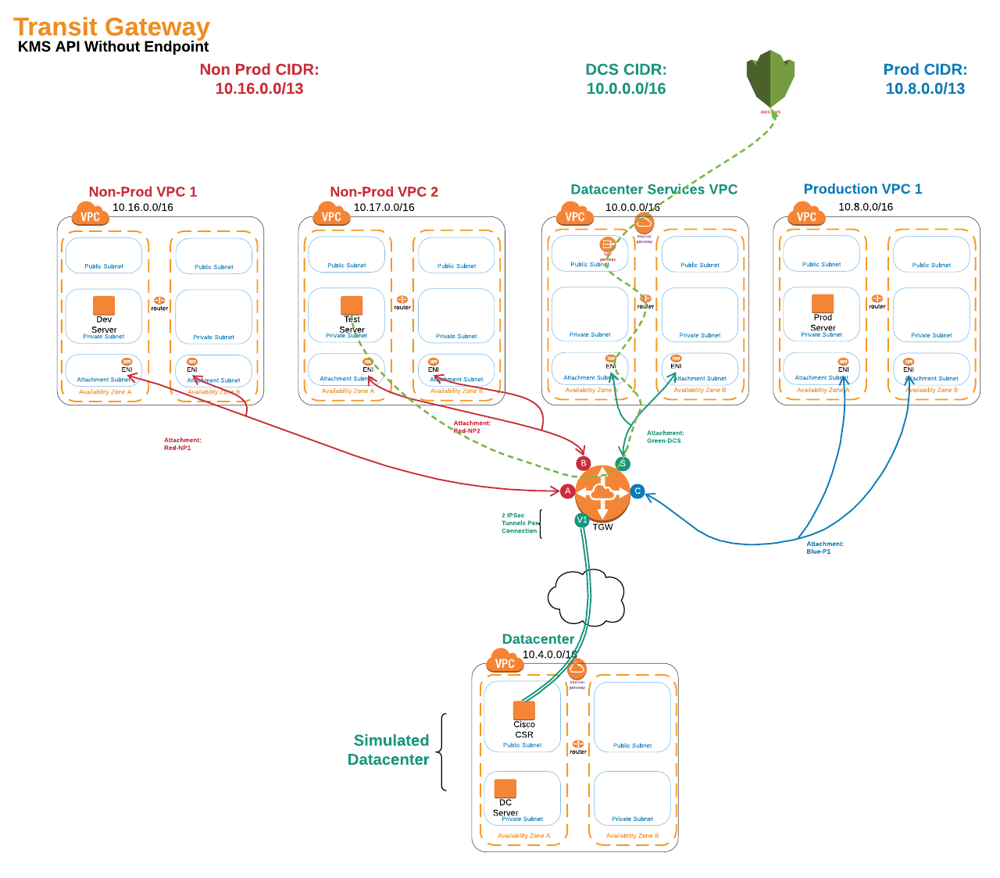
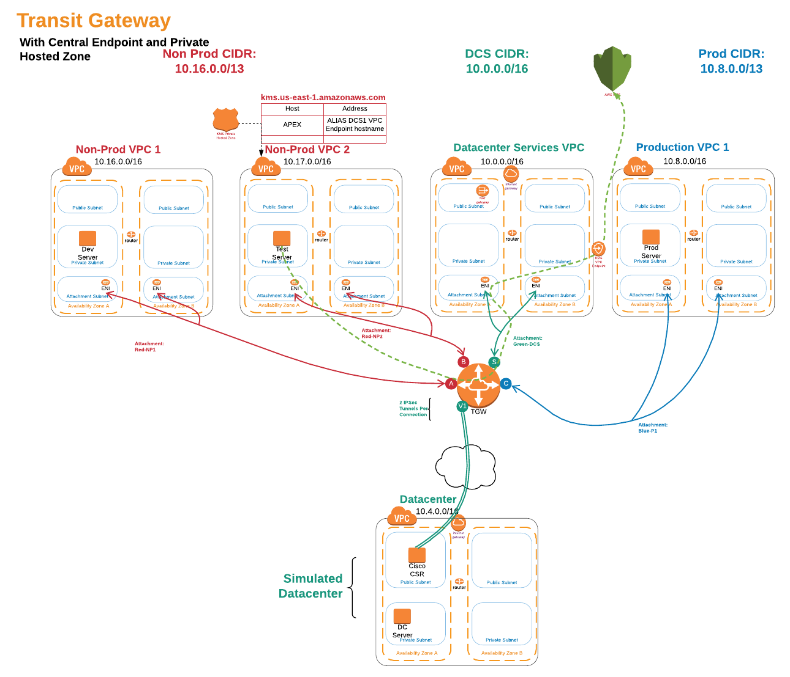

# VPC Endpoints Overview

We can use VPC endpoints if we require communication between resources within our VPCs and supported AWS services (Kinesis, Glue, KMS, etc.) without the need of crossing an Internet Gateway, NAT Gateway, VPN connection or AWS Direct Connect. A full list of the services available as VPC endpoints can be found [here](https://docs.aws.amazon.com/vpc/latest/userguide/vpc-endpoints.html "external link").

VPC Endpoints are virtual devices. They are horizontally scaled, redundant and highly available VPC components. See the [AWS Documentation](https://docs.aws.amazon.com/vpc/latest/userguide/vpc-endpoints.html "external link") for more info.

In a multi-VPC environment, such as this workshop, we have a choice at the time of defining where these VPC Endpoints will reside: in the local VPC that is accessing the AWS Service, or in a common, shared VPC. In some cases, you may decide to have some VPC Endpoints in a central VPC and some in the local VPCs. In this scenario we will add a KMS VPC endpoint within the **DCS1 VPC**, and the other VPCs will be able to use this central endpoint.

See below how the communication towards the KMS service flows from the NP2 VPC **before** the creation of the VPC Endpoint, crossing the NAT Gateway and Internet Gateway within the DCS1 VPC: 

On the other hand, in this lab we will provision:
- A KMS VPC Endpoint within the **DCS1 VPC**
- A Route 53 DNS Internal Zone associated with the NP2 VPC so any DNS query for the KMS service is routed to the VPC Endpoint within the DCS1 VPC

This would make the traffic flow as follows:
	