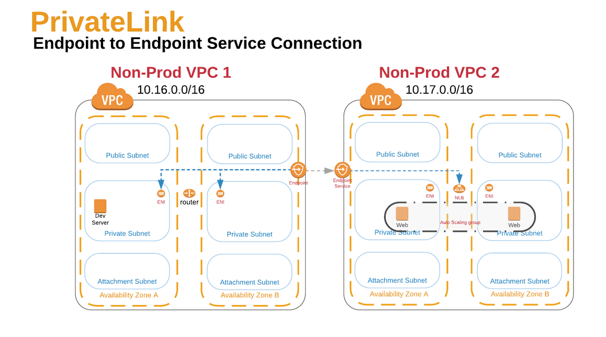

# VPC Endpoint Services Overview

VPC Endpoint Services rely on the AWS PrivateLink technology, which simplifies the security of data shared across cloud-based applications by eliminating the data exposure to the public Internet. AWS PrivateLink provides private connectivity between VPCs, AWS services, and on-premises applications. 

While we could choose to provide connectivity to an application via Transit Gateway, there may be times where we want to share our application to external clients.

Some common scenarios in which you might want to use VPC Endpoint Services:
1. Application in a VPC that has no VPN or TGW access to other VPCS.
1. Application in a VPC which has overlapping IP addresses with the VPC you want to share it with
1. Sharing an application with external consumers in other AWS accounts (even via MarketPlace)
1. Limit the firewall rules for access to an on premise application by using Privatelink as a single point of access for all VPCs in a region

In this lab we will focus on the use case number 3) above. 

We will provision an Endpoint Service on the "Provider side" (where our application is to be shared from). This will require a Network LoadBalancer (NLB) and corresponds to the right portion of the diagram below (NP2 VPC).

Similar to the previous lab (lab number #4), the "Consumer side" will be using a VPC Endpoint for accessing that application. This corresponds to the left portion of the diagram below (NP1 VPC).

