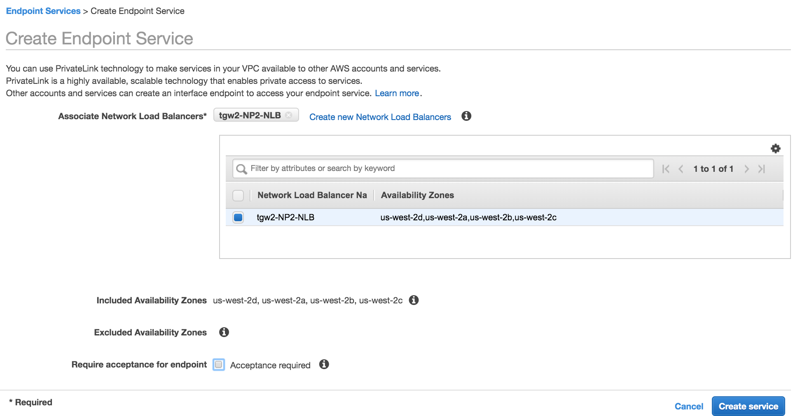

# Create Endpoint Service

As the Service Provider, you want to enable your NLB to be shared with other VPCs. You can whitelist AWS accounts that can create Endpoints in their VPCs if they explicitly know the name of your new Endpoint Service. You also have the ability to require explicit acknowledgement from the Service provider side, before their Endpoint becomes active:

1. In the AWS Management Console choose **Services** then select **VPC**.

1. At the menu on the left, scroll down and select **Endpoint Services**. Endpoint Services allow us to make a Network Load Balancer available to other VPCs, even in other AWS Accounts.

1. In the main pane, click the **Create Endpoint Service** button. 

1. On the **Create Endpoint Service** page select your load balancer for **Associate Network Load Balancers**

1. You will see the included Availablity Zones listed out. If you selected All-AZs from the Cloudformation template, all AZs for the region should be listed, as the NLB was deployed in a new set of subnets.

1. Uncheck the **Require acceptance for Enpoint**. *Note: other AWS accounts still won't be able to connect to your Endpoint Service. Only VPCs in your AWS account have access until you add AWS Account numbers to a whitelist.*

	

1. Click the **Create service** button at the bottom of the page.

1. In a few minutes, the **Status** should be **Available** in the **Endpoint Services** list. Make a note of the **Service name** in the **Details** tab. It will start with **com.amazonaws.vpce.*region_name*.vpce-svc-...**. You will need to paste this **Service name** in the next section
