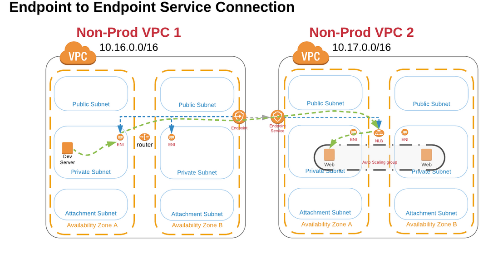

# Final Testing

1. In the AWS Management Console choose **Services** then select **Systems Manager**.

1. From the menu on the left, scroll down and select **Session Manager**. Session Manager allows us to use IAM role and policies to determine who has console access without having to manage ssh keys for our instances.

1. In the main pane, click the **Start session** button. Pick the **NP1 Instance** to shell into. You will now enter a bash shell prompt for that instance.

1. Let's curl web.np1.aws._your_domain_name_. You should get a response from one of the two instances in the Load Balancer Autoscaling Group which is in the Target Group:

```
Welcome to my web server. Server private IP is 10.17.23.165
Availability Zone: us-west-2b
Stack Name: tgw2
your ip is 10.16.18.25
```
</br>

And this is what the final flow looks like:
