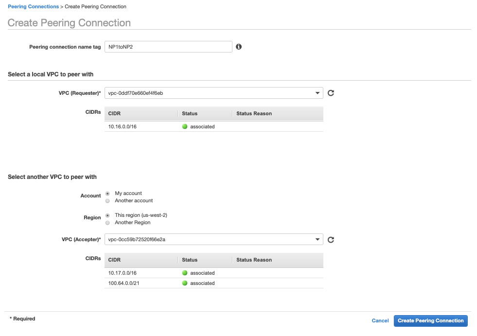
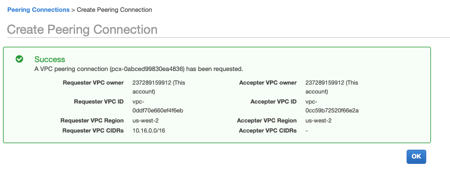

# VPC Peering Request

1. In the AWS Management Console choose **Services** then select **VPC**.

1. From the menu on the left, scroll down and select **Peering Connections**. Peering Connections allow us to connect two VPCs, even in other AWS Accounts. We will focus on the local region, but you can also create cross-region VPC peering.

1. In the main pane, click the **Create Peering Connection** button. 

1. On the **Create Peering Connection** page: give your connection a **Peering connection name tag**, Select your **NP1-*your-stack*** VPC for **VPC (Requester)**, keep Account and Region at defaults, and Select **NP2-*your-stack*** VPC for **VPC (Accepter)**.

1. You will see the CIDR ranges for each listed out. Peering will not succeed if there is an overlap IP CIDRs between the two VPC.
	

1. Click the **Create Peering Connection** button at the bottom of the page.

1. You should get a Success Page, click **ok**.
	

1. In the main pane, verify you have the box next to the peering line item checked, and from the **Actions** button, select **Accept Request**.
	

1. In the main pane, the peering connection line item should now show **Active** in the **Status** column.
	