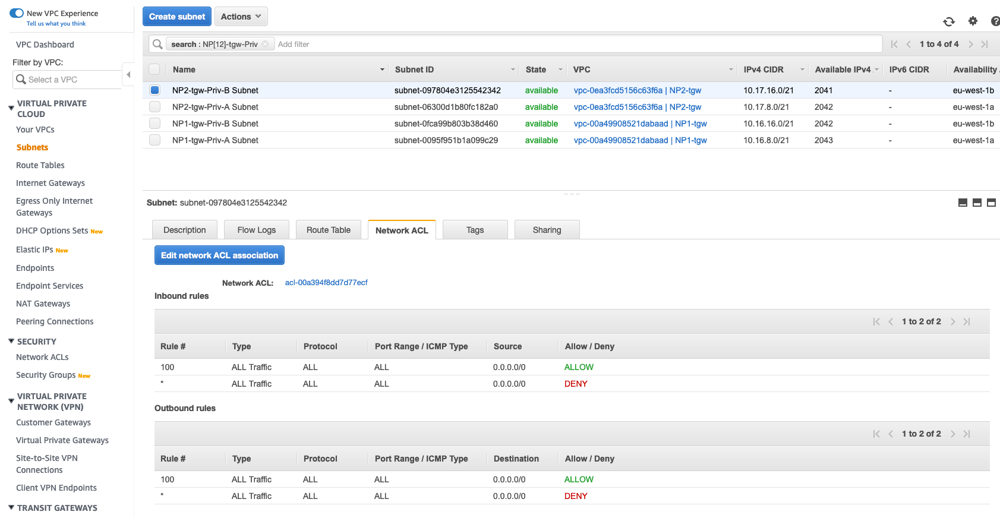
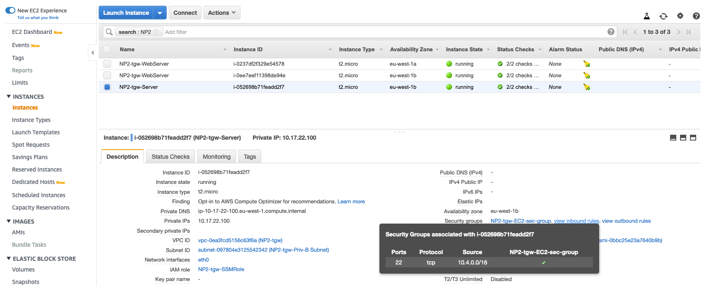
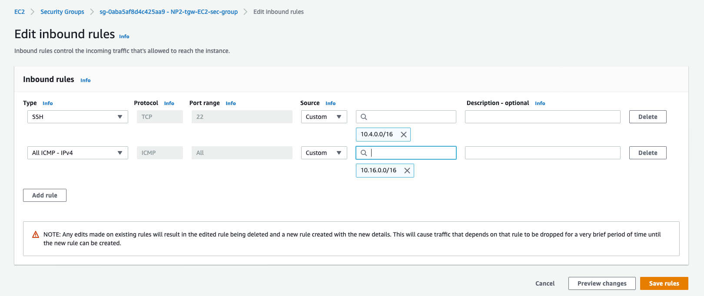

# Final Testing

1. In the AWS Management Console choose **Services** then select **Systems Manager**.

1. From the menu on the left, scroll down and select **Session Manager**. Session Manager allows us to use IAM role and policies to determine who has console access without having to manage ssh keys for our instances.

1. In the main pane, click the **Start session** button. Pick the **NP1 Instance** to shell into. You will now enter a bash shell prompt for that instance.

1. Let's try to ping the EC2 instance located within the **NP2 Private Subnet**. You can get the NP2 instance ip from the EC2 section:
	

1. Despite properly configuring VPC Peering it looks like the ICMP ping is not succeeding...

```
sh-4.2$ ping 10.17.22.100
PING 10.17.22.100 (10.17.22.100) 56(84) bytes of data.
^C
--- 10.17.22.100 ping statistics ---
143 packets transmitted, 0 received, 100% packet loss, time 145395ms

sh-4.2$
```


<details>
 <summary><p style="color:blue"><b>Lab #6 - QUESTION 1 </b><i>(Click to see the answer)</i></p>
  <b>Something is missing and it doesn't seem to be related with the VPC Peering configuration. As a hint, feel free to review the VPC security components covered in Lab #1. Are you able to figure out why ping is not working?</b></br>
  </summary><p>
  
If we carry out a quick review at the Subnet NACLs, they look ok on both ends and should allow ICMP traffic:
	

However, the Security Group applied to the NP2 instance doesn't seem to allow inbound ICMP traffic:
	

Click the security group and add a new Inbound statement to allow any ICMP traffic from the NP1 VPC CIDR. As Security Groups are stateful, the return packet will be able to make its way without any problem:
	


Re-test the ICMP ping. It should now succeed:
```
sh-4.2$ ping 10.17.22.100
PING 10.17.22.100 (10.17.22.100) 56(84) bytes of data.
64 bytes from 10.17.22.100: icmp_seq=1 ttl=255 time=0.362 ms
64 bytes from 10.17.22.100: icmp_seq=2 ttl=255 time=0.437 ms
64 bytes from 10.17.22.100: icmp_seq=3 ttl=255 time=0.412 ms
64 bytes from 10.17.22.100: icmp_seq=4 ttl=255 time=0.489 ms
^C
--- 10.17.22.100 ping statistics ---
4 packets transmitted, 4 received, 0% packet loss, time 3063ms
rtt min/avg/max/mdev = 0.362/0.425/0.489/0.045 ms
sh-4.2$
```
</details>


