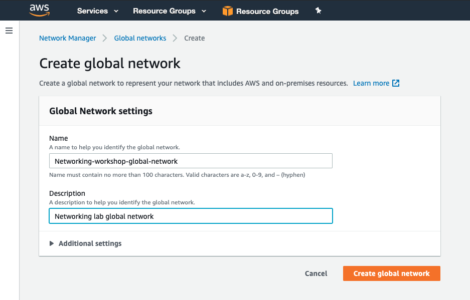
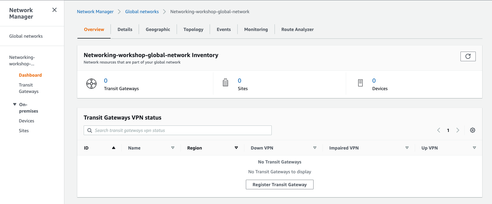
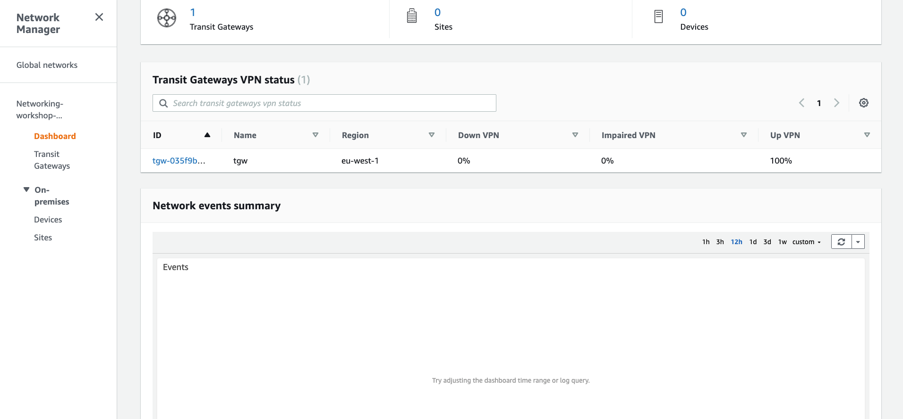

# Network Manager Setup

We will first create a Global Network, which acts as a container for all the objects within your network (Transit Gateways, Sites, Devices, etc). Some of these objects already exist (Transit Gateway) whereas other objets will be created in the next section of the lab (Sites, Devices...)

### Create a Global Network

1. In the AWS Management Console change to the region you are working in. This is in the upper right hand drop down menu.

2. In the AWS Management Console choose **Services** then select **VPC**.

3. From the left-hand menu select **Network Manager**. _It's near the bottom, in the **Transit Gateways** section._

4. Click **Create a Global Network** in the main panel

5. Give your new global network a name and description.

6. Click **Create Global Network** to complete the setup.
    

7. Once complete your global network should be in the state *available*.
    

8. Click into the global network and click **Register Transit Gateway**.
	

9. Put a check next to the Transit Gateway with the name *tgw* and click **Register Transit Gateway**.

10. After a few minutes the registration state will turn to *Available*.
     

11. From the left-hand menu click **Dashboard**.
     Here you will be able to see high level statistics related to your network. For example, in our case the VPN status is showing as *100%*.

12. The final setup step is to integrate the Network Manager with our global network. Under *Network events summary* click **Onboard cloudwatch log insight**. After a few seconds you will be presented with a blank dashboard as there have not been any network events raised yet.
	

This concludes the initial setup of the Network Manager. In the next section we will add in our on-premises site details and walk through the console to understand what information is available to us. 
