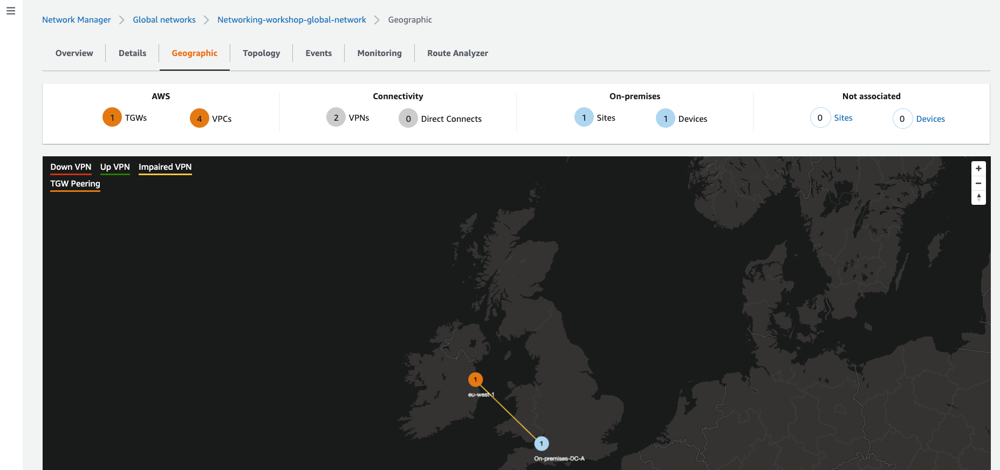
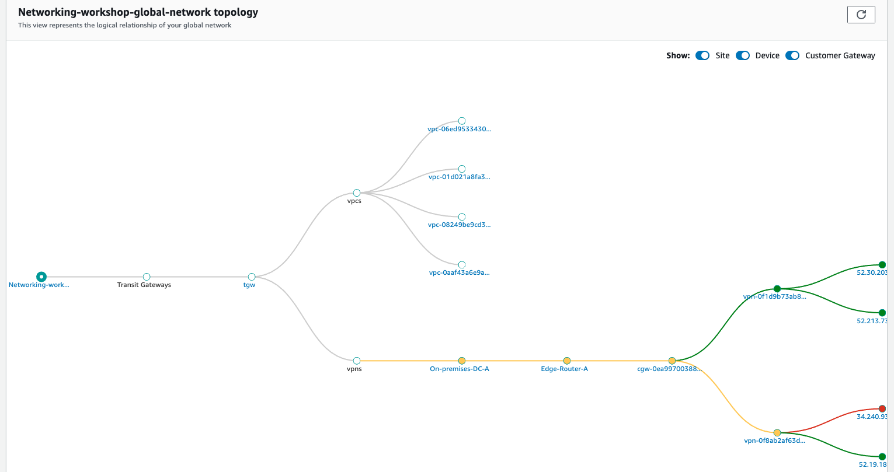
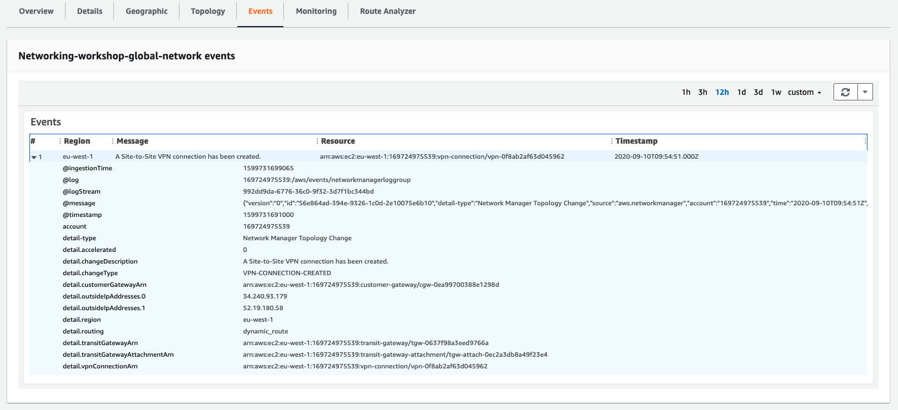

# Network Manager Troubleshooting

In this last section we will simulate a failure and use network manager to isolate where the failure is so we can start to remediate it.

### Simulate a failure

In order to simulate the failure, we are going to disable one of the VPN tunnels. We'll do this by changing the Pre-Shared Key (PSK) assigned to one of the tunnels so it fails to connect.

1. In the AWS Management Console change to the region you are working in. This is in the upper right hand drop down menu.

2. In the AWS Management Console choose **Services** then select **VPC**.

3. In the left-hand menu click **Site-to-Site VPN Connections**, check one of the connections in the main panel, choose **Actions** and select **Modify VPN Tunnel Options**. Select either of the tunnels and change the **Pre-Shared Key** to **awsamazon1** and check the box for **Confirm Tunnel UP Modification**. Click **Save**. Click **Close**.

3. Wait for the status to return to **available**, this can take a few minutes. Once complete you will notice one of the tunnels states **DOWN**.

    
    
4. In the left-hand menu click **Network Manager**. Click **View my Global Networks** and select the network we created earlier.

5. Instantly you will see our VPN Network shows as impaired at 50%.

    

### Investigating the failure

6. Click on the **Geographic** tab and you will notice that the VPN state is now orange and showing as impaired.

   

7. Click on the **Topology** tab and you will notice that the VPN state is also showing as impaired but this time with more information on which path on which tunnel is broken. You can then click on the VPN connection to get a link directly to the configuration parameters for the tunnels.

   

8. Click on the **Events** tab and you'll be able to see the event that was generated when we made the change to the tunnel.

   

This concludes the module explaining how you can get visibility and monitoring into your global network AWS Transit Gateway Network Manager.

